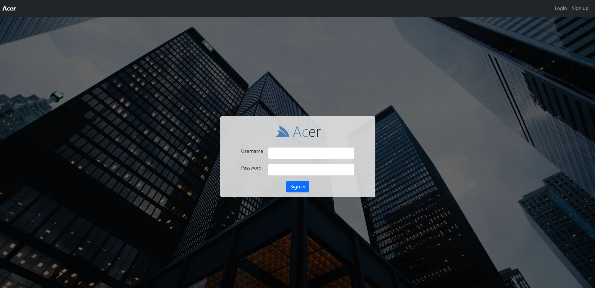

# acer

  

<h2>Angular based Task Management application</h2>

<h2>Overview</h2>

Acer is a task management application where one can manage, capture, edit their tasks. It can be used to create task lists with most important to-dos and manage it easily
 

<h2>Features:</h2> 
<ul>
  <li>Create, Edit and Delete tasks</li>
  <li>Extra feature - Weather service for various cities is being implemented using Microservices</li>
  <li>Application is containerized using Docker and images are pushed to Docker hub</li>
</ul>

<h2>Technologies used</h2> 
<ul> 
  <h3>Frontend:</h3>
  <li>Angular</li>
  <li>HTML</li>
  <li>CSS3</li>
</ul>
<ul> 
  <h3>Backend:</h3>
  <li>Java</li>
  <li>Spring Boot</li>
  <li>Microservices - Eureka, Spring Cloud</li>
</ul>
<ul> 
  <h3>Container:</h3>
  <li>Docker</li>
</ul>
